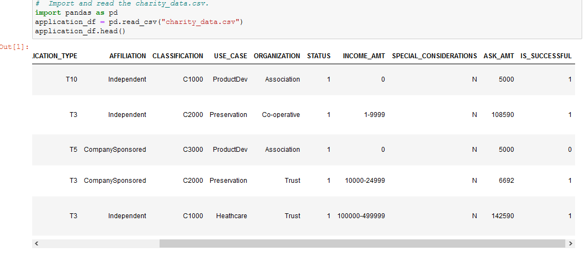
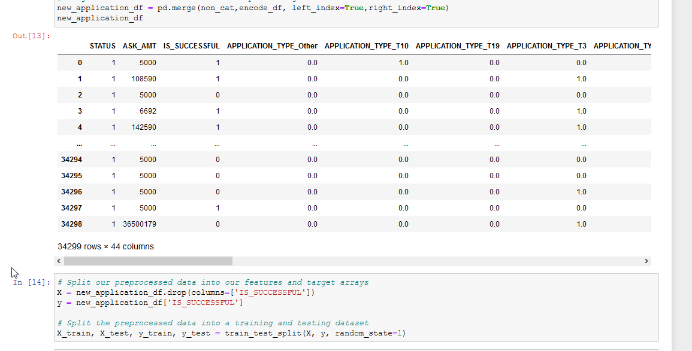
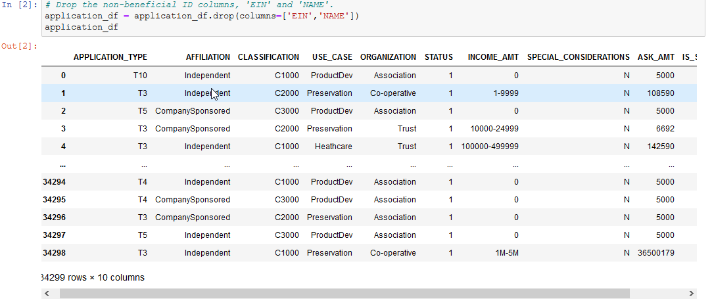
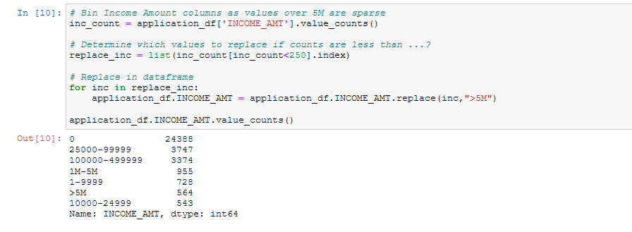
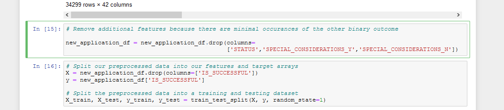
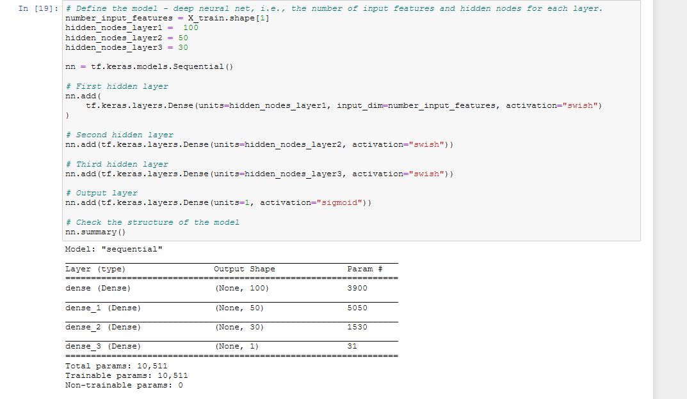

# Neural_Network_Charity_Analysis

## Overview of Analysis
The purpose of the analysis is to develop a deep learning neural network with the given dataset to develop a binary classifier that will enable prediction of successful applicants for funding at Alphabet Soup.

## Results
Below are the results on our development of the neural network, where we will discuss primarily on the base model developed and later go over the optimized version.

### Data Preprocessing

- For the model, the "IS_SUCCESSFUL" column is our target/dependent variable as we are trying to find out whether an applicant given various features are likely to be successful after funding.

- The feature variables for the model are basically all the other columns (minus the noisy variables). Below is a quick screenshot of all the feature variables once they have been encoded.

- Lastly, during our preprocessing stage we have removed the ID and names of organizations from our model as they do not explain whether an organization is successful and cannot influence new data.

### Compiling, Training, and Evaluating the Model

- With the base model, we had used two hidden layers and hidden nodes of 80 & 30 respectively. We had chosen the two hidden layers so that our model is a deep learning model able to handle complex data i.e. given the number of features we have; the nodes were chosen to optimize both performance and to handle complexity of data. For the activiations, we used RELU for the first two and signmoid on the output layer; RELU is chosen as it seems best suited at targeting positive non-linear data and sigmoid is chosen for the output as it is ideal for binary classification.

- Unfortunately our base model was unable to pass the 75% threshold of performance as shown below.

- To optimize the model, we did the following:
   
    - Binned the "Income_Amt" variable, as those categorized over 5M were sparse.

    

    - Removed additional noisy variables in "Status" and "Special_Considerations", as there were only a few instances of different binary outcomes.

    

    - Adjusted the neural network tuning where we increased the nodes & hidden layers in hopes of better learning. We had also changed the activiation of our input & hidden layer to SWISH, which is said to be a better version of RELU.

    

- Despite these changes however, our optimized model was unable to pass the 75% threshold and was only able to see minor gains.

## Summary

Overall our base deep learning model was able to achieve 72.6% while additional tuning bumped the accuracy to 72.8%, both fairly close to the threshold of 75%. Because there seemed to be minimal gains after tuning the deep learning model, we may need to look at other machine learning models and see if they are better at predicting the data. One recommendation is to use the SVM model where it is designed for binary classification problems.